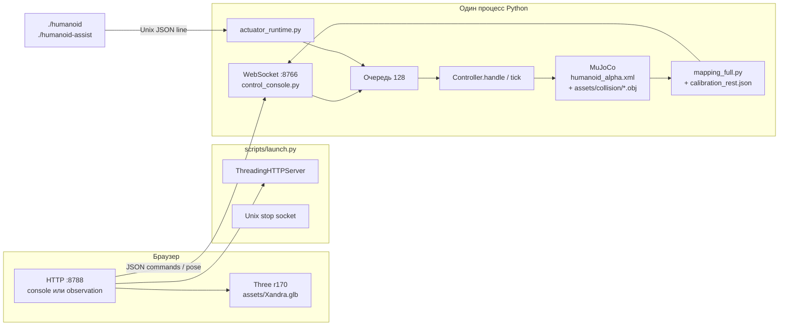

# 02. Архитектура

В одном коммите живут **два контура**. Продуктовый вход — первый. Второй оставлен как POC.

## Контур A — START.command (порты 8788 / 8766)

```
START.command
  → .venv + requirements.txt
  → scripts/launch.py <debug|experiment|assisted>
       ├─ HTTP 127.0.0.1:8788  (статика корня репозитория, редирект /)
       ├─ control socket /tmp/humanoid-launcher-<uid>-<hash>.sock
       ├─ разовый прогон control_console.py --inventory → reports/control_inventory.json
       └─ subprocess: physics/control_console.py --port 8766
            [+ --actuator-api --actuator-log reports/actuator_commands.jsonl]  # experiment, assisted
            [+ --assisted-stand]                                                # только assisted
```

Флаги собраны в [scripts/launch.py](../scripts/launch.py) (строки запуска `command.extend`).

Браузер грузит GLB сам: `../assets/Xandra.glb` из [viewer/console-viewer.js](../viewer/console-viewer.js) и [viewer/observation.js](../viewer/observation.js). Физика GLB не грузит. Коллизии — отдельные OBJ, прописанные в [physics/model/humanoid_alpha.xml](../physics/model/humanoid_alpha.xml).

### Поток кадра (контур A)

1. Один цикл в `control_console.serve` забирает очередь (макс. 128), вызывает `Controller.handle` **или** `ActuatorAPI.apply`. Обработчик WebSocket состояние не пишет.
2. Если режим `dynamic` и не paused: догоняет `mj_step` шагами `opt.timestep` (в XML **0.002 с**). Накопленное время за итерацию режется до **50 мс**.
3. `Controller.tick`: при включённом assist сначала `AssistedStandController.compute` пишет `data.ctrl`, затем `mj_step`, затем `mj_forward`. Нефинитный qpos/qvel → `env.reset()` + пауза.
4. Не реже 30 Гц (`now - broadcast >= 1/30`) всем клиентам уходит JSON `type: pose`. Поза строится `extract_full_pose` ([physics/bridge_full/mapping_full.py](../physics/bridge_full/mapping_full.py)) из наблюдения env и `HumanoidDiag.body_xpos/xquat`.
5. Вьюер переводит кватернионы Z-up → Y-up и крутит кости GLB. Observation и console-viewer: `q_yup = QC * q_zup` **без** сопряжения. Старый [viewer/main.js](../viewer/main.js): `QC * q * QC^{-1}`.

Владение:

- Без `--actuator-api`: первый WebSocket-клиент — owner. Остальные read-only. Закрытие owner обнуляет ctrl, пауза, эпоха очереди сбрасывается.
- С `--actuator-api`: owner — объект API, не вкладка. Консоль остаётся наблюдателем (`can_control` false). Проверено ожиданием в [tests/test_launch.py](../tests/test_launch.py): debug → kinematic + can_control; experiment → dynamic + не can_control.

Команды браузера (консоль): `joint`, `torque`, `mode`, `reset`, `pause`, `resume`, `zero`, `assist`. ACK с `request_id` и `revision`, либо `type: error`. Лимит сообщения WebSocket: 16 KiB. Origins: `None`, `http://127.0.0.1:8788`, `http://localhost:8788`. Ping 10 с / timeout 10 с.

### Актуаторы

```
./humanoid act <33 float> | ./humanoid zero
        │  JSON {"values":[...]} + \n
        ▼
Unix SOCK_STREAM  /tmp/humanoid-actuator-<uid>.sock   (0600)
override: HUMANOID_ACTUATOR_SOCKET
        ▼
ActuatorAPI.handle → очередь → ActuatorAPI.apply (только из цикла физики)
        ▼
RAW:     data.ctrl[:] = values     (уже отвергнуто, если вне ctrlrange; clamp нет)
ASSIST:  u_cmd[:] = values; data.ctrl = assist.compute(...)  (сумма клипится в ctrlrange)
```

Ответ клиенту: строка `OK` или `ERROR ...`. `./humanoid` печатает наружу только `OK` либо короткую ошибку без имён модели. `humanoid-assist status` печатает `OK ` + JSON статуса (другой контракт, readline до 4096 байт).

Лог: `reports/actuator_commands.jsonl` (append). Поля: `wall_time` UTC, `sim_time`, `values`, `result` accepted|rejected.

### Assisted stand

Слой **над** RAW, не вместо сокета. Класс [physics/assisted_stand.py](../physics/assisted_stand.py). Включён, если:

- консоль: вкладка Assisted (`op: mode value=assisted`) или WS `op: assist`;
- процесс с `--assisted-stand` (меню 3): после старта API вызываются mode=dynamic, `set_assisted(True)`, resume.

`set_assisted(True)` один раз пишет qpos через `reset_to_stand` (`mj_resetData` + qpos0). Дальше `compute` qpos не пишет. Выключение: `ctrl := u_cmd`, поза не переписывается.

Capability в инвентаре консоли всегда `assisted_capability: True` (`Controller.discover`). Флаг CLI только авто-включает, не «компилирует» слой.

## Контур B — демо ws_bridge (8787 / 8765)

[scripts/run_demo.sh](../scripts/run_demo.sh):

- HTTP `python -m http.server 8787 --bind 127.0.0.1`
- `python physics/ws_bridge.py --scenario <имя> --broadcast-hz 30` (дефолт сценария в скрипте `fall`; дефолт argparse у самого bridge — `knee`, дефолт Hz — 60)

Модель та же: `physics/model/humanoid_alpha.xml`. Калибровка: `physics/bridge_full/calibration_rest.json`. Шаг физики снова 0.002, assert в bridge. Клиент [viewer/index.html](../viewer/index.html) + [viewer/main.js](../viewer/main.js): ручные слайдеры колена/плеча **или** кнопка Physics WS. Сценарии крутят ctrl внутри bridge (`knee_r_motor`, `shoulder_r_*`), не через `./humanoid`.

Контуры делят модель и маппер, **не** делят порты. Одновременно их можно поднять только если порты не пересекаются. `stop-project.command` умеет гасить оба по cmdline (`control_console.py`, `ws_bridge.py`, `http.server 8788`, лаунчеры) если cwd процесса — корень проекта. HTTP 8787 в regex остановки **не** упомянут (только `http.server 8788`).

## Диаграмма (контур A)



## Что сознательно не в цикле

- Запись в MuJoCo из JS. Схема односторонняя: физика → поза → кости.
- Баланс в `ws_bridge` и в Position mode. Падать под гравитацией в dynamic без assist — ожидаемо ([docs/CONTROL_ARCHITECTURE.md](../docs/CONTROL_ARCHITECTURE.md); фраза «no balance controller» там устарела относительно `assisted_stand.py`, см. [06-open-questions.md](06-open-questions.md)).
- Пальцы и пальцы ног как отдельные суставы. Ключицы вварены в торс (`assumptions.json` → `engineering_welds`).
